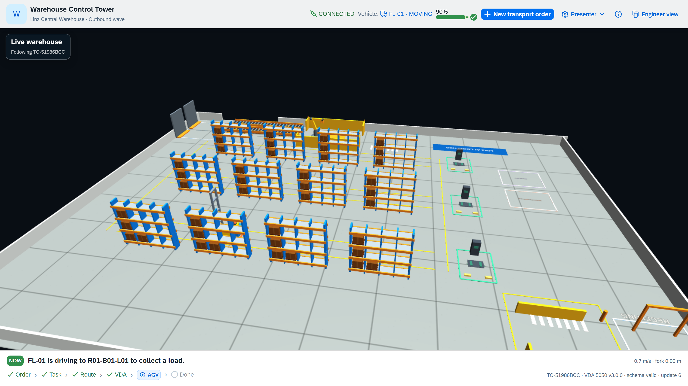
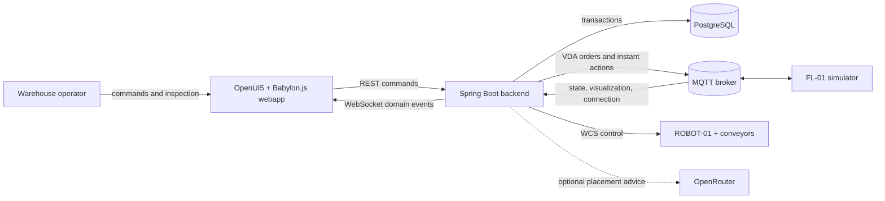
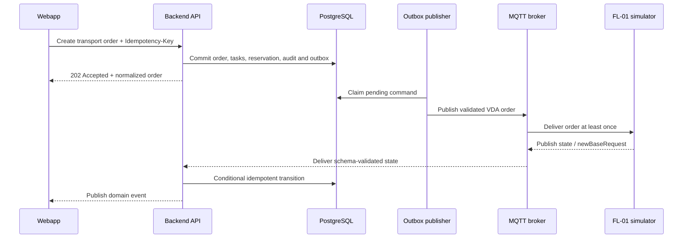

# Warehouse Control Tower

A warehouse control-tower reference system built with OpenUI5, Babylon.js, Spring Boot,
PostgreSQL, MQTT, and a simulated autonomous forklift. It turns business transport orders
into independently schedulable load movements, dispatches schema-validated VDA 5050 v3.0.0
orders, and presents execution as both an operator story and an inspectable engineering trace.

**Live demo:** <https://whv.aipoweredapps.dev>

> This is a reference implementation for product and system-design discussion. It is not
> VDA-certified, a functional-safety component, or a production deployment.



## What the system demonstrates

- A business-facing transport-order model that does not expose VDA sequencing details.
- Deterministic inbound, outbound, and mixed-shift scenarios with real inventory transitions.
- Durable command dispatch through a transactional outbox and at-least-once MQTT delivery.
- VDA 5050 v3.0.0 order, state, visualization, connection, and instant-action exchanges.
- A 3D operator view driven by 20 Hz telemetry without putting pose traffic on the command path.
- An operations workspace with contextual technical inspection for VDA updates, validation, and audit data.

## Architecture

### System context



The backend is the transactional system of record. The simulator behaves like an external
mobile robot and communicates only through MQTT. The browser renders backend projections and
issues commands through public REST and WebSocket boundaries; it never reconstructs
authoritative inventory state.

| Component | Owns | Boundary |
| --- | --- | --- |
| `webapp` | Operator workflows, presentation selectors, REST/WebSocket clients, 3D rendering and interpolation | No database access and no authoritative inventory logic |
| `backend` | Inventory, transport orders, tasks, reservations, routing, dispatch audit, runtime state and transactions | Only component allowed to mutate business state |
| `simulator` | Vehicle physics, fork state, VDA execution and telemetry publication | MQTT-only; no backend or database dependency |
| `vda5050-contracts` | Wire records and pinned upstream v3.0.0 schemas | Independent of backend and simulator implementation code |
| PostgreSQL | Durable business state, audit history and pending outbox commands | Transactional data, not high-frequency pose storage |
| MQTT | At-least-once device integration | Integration boundary, not an internal application method bus |

### Business intent and device instructions

The system deliberately keeps three concepts separate:

```text
Transport order (operator intent)
  -> transport tasks (independently schedulable load movements)
    -> VDA orders (versioned instructions for one vehicle)
```

`DispatchService` performs the translation. A VDA `orderId` remains stable for a task while
`orderUpdateId` increases as additional base nodes are released. The public product API does
not expose VDA node sequencing as part of the business order model.

### Command path



Commands are durable. Broker loss leaves rows pending in the outbox, and reconnect resumes
publication with stable identities. Duplicate MQTT delivery is expected, so consumers and
state transitions are idempotent.

### Telemetry path

Visualization is intentionally separate from the transactional path:

```text
Simulator at 20 Hz -> MQTT -> latest in-memory pose -> WebSocket -> delayed render clock
                                      |
                                      +-> PostgreSQL sample capped at 2 Hz
```

Intermediate pose samples may be coalesced; commands may not be lost. The browser filters
stale events and uses `requestAnimationFrame` interpolation for vehicle pose and fork motion.

### Core invariants

- An AGV has at most one active task, and a load has at most one active destination reservation.
- Only released base nodes execute; horizon nodes remain planning information.
- VDA order updates are monotonic, and all standard outbound payloads validate before publication.
- State changes are conditional on valid predecessor states and tolerate duplicate delivery.
- A stale simulation epoch can update neither inventory nor vehicle state.
- Optional AI advice is constrained and validated by deterministic business rules; provider
  failure creates no tasks and changes no inventory.

### Code organization

```text
webapp/
  controller + view fragments     UI orchestration and operator workflows
  service/                        REST and WebSocket boundaries
  model/                          wire types, selectors and presentation builders
  visualization/                  scene, entities, factories, animation and telemetry

backend/
  api/                            controllers, DTO mapping and Problem Details
  transport/                      order, task, dispatch and robotic-cell orchestration
  fleet/ routing/ inventory/      assignment, paths, reservations and placement rules
  mqtt/ vda5050/                  broker transport and standard-message handling
  persistence/outbox/             durable asynchronous command publication
  events/ scenario/ observability application events, demo lifecycle and operational signals

simulator/
  vehicle/ execution/ runtime/    physical state, VDA execution and epoch-aware controls
  mqtt/ vda5050/                  external-device transport and wire translation
```

For detailed runtime boundaries, trade-offs, and failure behavior, see
[Architecture](docs/ARCHITECTURE.md).

## Run locally with Docker

Requirements: Docker Desktop with Compose v2.

```powershell
Copy-Item .env.example .env
docker compose up --build --wait
```

Open <http://localhost:8080>. The default `AI_PROVIDER=mock` is deterministic and requires no
external account or API key.

On first launch, choose one deterministic operational story:

- **Balanced shift:** concurrent inbound and outbound demand.
- **Inbound surge:** a high-priority six-load put-away order.
- **Outbound wave:** an urgent six-load shipment through the robotic cell.

The selected scenario starts automatically. Reloading preserves it; **Reset scenario** returns
to the chooser.

To remove the local database and broker data and return to a clean demo:

```powershell
docker compose down -v
```

This is destructive. It deletes all data stored in the Compose volumes.

### Optional OpenRouter placement advice

The mock provider is the recommended default. To exercise external placement advice, set:

```dotenv
AI_PROVIDER=openrouter
OPENROUTER_API_KEY=your-key
OPENROUTER_MODEL=openai/gpt-4o-mini
OPENROUTER_PROVIDER=groq
```

The API key is used only by the backend. Provider failures are reported to the operator and do
not create jobs or mutate inventory. Provider compatibility and cost guidance are documented
in [Operations](docs/OPERATIONS.md).

## What to explore

1. Choose **Inbound surge** and inspect the generated business order and six transport tasks.
2. Follow the story view narration and pipeline from operator intent to completed execution.
3. Orbit with drag, pan with **WASD**, and zoom with the wheel while live telemetry moves FL-01.
4. Open **How this works** to inspect the six steps between a REST request and a moving forklift.
5. Switch to **Operations view**, select **Technical details**, and inspect schema validation,
   stable order identity, update IDs, base/horizon release, and raw payloads.
6. Pause and resume the fleet to observe standard `startPause` and `stopPause` instant actions.

## Public interfaces

| Interface | Endpoint or topic | Purpose |
| --- | --- | --- |
| REST | `/api/v1` | Commands and current warehouse projections |
| WebSocket/STOMP | `/ws` | Domain changes and coalesced live telemetry |
| VDA MQTT | `vda5050/v3/demo/FL-01/{topic}` | `order`, `instantActions`, `state`, `visualization`, and `connection` |
| Project MQTT extensions | `vda5050/v3/demo/FL-01/control`, `.../handling` | Simulation epoch/time controls and fork kinematics |
| Health | `/actuator/health` | Backend health inside the service network |
| Metrics | `/actuator/prometheus` | MQTT, telemetry, outbox and transition metrics |

Every emitted standard VDA payload is checked against the pinned v3.0.0 schema. Transport-order
creation accepts an optional `Idempotency-Key`; reuse with the same body returns the existing
order, while conflicting reuse returns RFC 9457 Problem Details.

See the [OpenAPI definition](docs/openapi.yaml) and [MQTT contract](docs/MQTT.md) for the complete
wire contracts.

## Development and verification

Java 21 and Node.js are required for host-side development. The Maven Wrapper is included, so a
global Maven installation is not required.

Frontend:

```powershell
npm ci
npm run typecheck
npm run build
npm run test:e2e
```

Backend, contracts, and simulator:

```powershell
.\mvnw.cmd test
```

To run PostgreSQL and Mosquitto while developing services on the host:

```powershell
docker compose up -d --wait postgres mosquitto
```

The focused package lifecycle suite can run directly or create a timestamped evidence bundle:

```powershell
npm run test:e2e:package
npm run test:e2e:package:record
```

Recorded output is written under `artifacts/e2e-runs/<timestamp>/` with the Playwright result,
report, test artifacts, run metadata, and best-effort Compose logs.

## Scope and production limits

The reference profile contains one Linz facility and one simulated forklift, FL-01. The public
model supports nullable vehicle assignment and multiple vehicles, but adding another working
vehicle requires vehicle-specific parking, charging, routing, and MQTT lifecycle support.

Authentication, production PKI, broker ACLs, high availability, general multi-AGV traffic
arbitration, and certified VDA conformance are intentionally outside the demo scope. The public
deployment adds TLS termination, secret injection, rate limiting, and private service networks,
but remains a compact reference deployment rather than a hardened warehouse control system.

## Documentation

- [Product brief](docs/PRODUCT.md): audience, outcomes, scope decisions, and evolution path.
- [Architecture](docs/ARCHITECTURE.md): detailed flows, invariants, package boundaries, and trade-offs.
- [Operations](docs/OPERATIONS.md): health, recovery, deployment, secrets, cost, and capacity.
- [OpenAPI](docs/openapi.yaml): public REST contract.
- [MQTT contract](docs/MQTT.md): standard and project-specific broker messages.
- [Threat model](docs/THREAT_MODEL.md): trust boundaries and security posture.
- [Roadmap](docs/ROADMAP.md): explicitly deferred capabilities.
- [Contributing](CONTRIBUTING.md): development and contribution expectations.

## License

Apache License 2.0. See [third-party notices](THIRD_PARTY_NOTICES.md) for VDA 5050, OpenUI5,
Babylon.js, and other component attribution.
