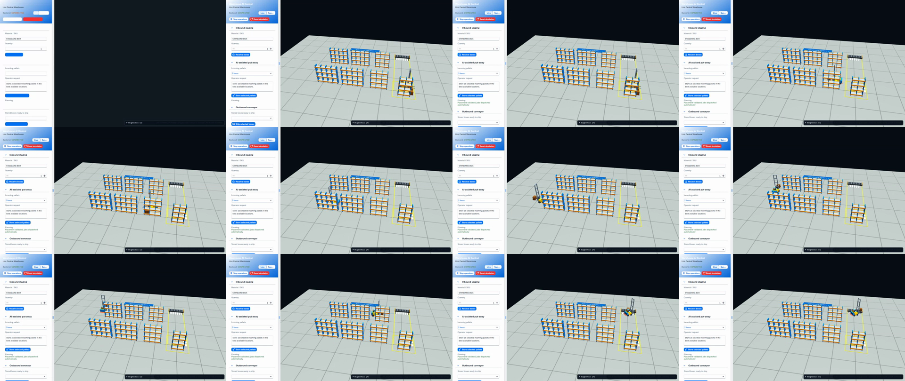

# Warehouse Control Tower

An OpenUI5 and Babylon.js warehouse control tower backed by Spring Boot, PostgreSQL, MQTT, and a simulated autonomous forklift. Business-facing transport orders are decomposed into load-movement tasks and dispatched as schema-validated VDA 5050 v3.0.0 orders.

> Reference implementation for product and system-design discussion. It is not VDA-certified, a functional-safety component, or a production deployment.

[Architecture](docs/ARCHITECTURE.md) · [Product brief](docs/PRODUCT.md) · [Operations](docs/OPERATIONS.md) · [Threat model](docs/THREAT_MODEL.md) · [Contributing](CONTRIBUTING.md)

[](artifacts/warehouse-control-tower.webm)

## Run locally with Docker

Requirements: Docker Desktop with Compose v2.

```powershell
Copy-Item .env.example .env
docker compose up --build --wait
```

Open <http://localhost:8080>. The default `AI_PROVIDER=mock` is deterministic and requires no external service.

On first launch, choose one of three deterministic operational stories:

- **Balanced shift**: concurrent inbound and outbound demand.
- **Inbound surge**: a high-priority six-load put-away order.
- **Outbound wave**: an urgent six-load shipment.

The selected scenario starts automatically. Reload preserves it; **Reset scenario** returns to the chooser.

To use OpenRouter, edit `.env`:

```dotenv
AI_PROVIDER=openrouter
OPENROUTER_API_KEY=your-key
OPENROUTER_MODEL=openai/gpt-4o-mini
OPENROUTER_PROVIDER=groq
```

OpenRouter failures are shown to the operator and do not create jobs or change inventory. The key is used only by the backend.

Reset the demo by removing its local volumes:

```powershell
docker compose down -v
```

This deletes the demo database and broker data.

## Development

The frontend remains a standard UI5 project:

```powershell
npm ci
npm run typecheck
npm run build
npm test
```

The repository includes a self-bootstrapping Maven Wrapper, so no global Maven installation is required:

```powershell
.\mvnw.cmd test
```

Java 21 is required for host-side Java development. PostgreSQL and Mosquitto can be started independently with:

```powershell
docker compose up -d --wait postgres mosquitto
```

## Service boundaries

- `backend/`: authoritative inventory, transport orders/tasks, scenario seeding, A* routing, REST, WebSocket deltas, MQTT outbox, and VDA dispatch audit trail.
- `simulator/`: independent AGV process; consumes orders and instant actions, then publishes VDA state, visualization, and connection messages over MQTT.
- `vda5050-contracts/`: shared message records and the official VDA 5050 v3.0.0 JSON schemas.
- `webapp/`: OpenUI5 control-tower UI and Babylon visualization with interpolated live vehicle movement.

REST starts at `/api/v1`, WebSocket/STOMP at `/ws`, and MQTT topics use `vda5050/v3/demo/FL-01/{order,instantActions,state,visualization,connection}`.

Transport-order creation accepts an optional `Idempotency-Key`; reuse with the same body returns the existing order and conflicting reuse returns RFC 9457 Problem Details. Operational metrics are available to the internal backend network at `/actuator/prometheus`.

## Interview demo path

1. Select **Inbound surge** and point out the automatically created business order and six transport tasks.
2. Follow FL-01 on the 3D map while the activity strip explains the current operation.
3. Open **VDA 5050** under the order detail tabs to show schema validity, stable order ID, update IDs, and the raw payload.
4. Pause and resume the fleet to demonstrate standard `startPause` and `stopPause` instant actions.
5. Use **Demo tools** to discuss rejection and blocked-route recovery without disrupting the normal happy path.

## Deliberate demo limits

The public data model and UI support nullable AGV assignment and multiple vehicles, but the demo simulates only FL-01. Authentication, TLS, and multi-AGV traffic arbitration remain outside the interview scope. Simulation speed, scenario reset, and failure injection are explicitly demo controls rather than VDA messages.

## License

Apache License 2.0. See [third-party notices](THIRD_PARTY_NOTICES.md) for VDA 5050, OpenUI5, Babylon.js, and other component attribution.
