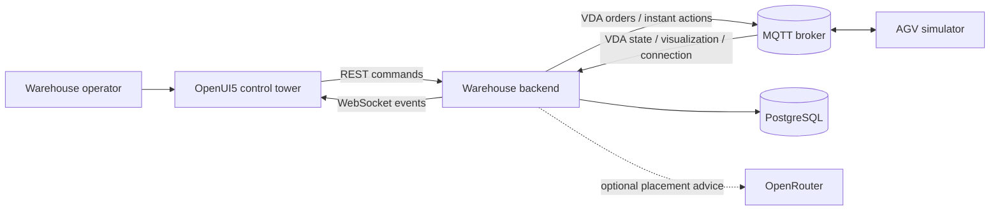
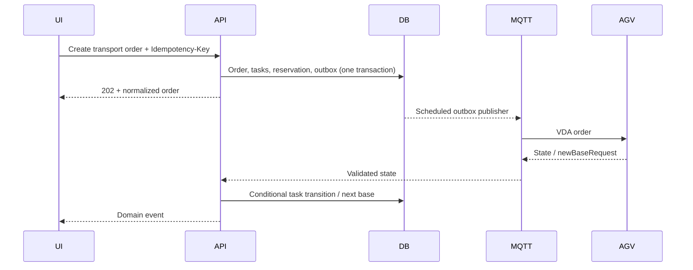

# Architecture

## System context

The backend is the transactional system of record. The simulator is deliberately isolated as an external device. MQTT is an integration boundary, not an internal method bus.

## Command and telemetry paths

Visualization follows a separate latest-value path: MQTT callbacks replace an in-memory pose, the backend emits lightweight pose events, and persistence samples at 2 Hz. Losing an intermediate pose is acceptable; losing a command is not.

## Ownership and consistency

Transport orders express operator intent; transport tasks are independently schedulable load movements; VDA orders are versioned device instructions. The dispatch audit links these layers without making the product API depend on VDA sequence mechanics. PostgreSQL transactions protect order/task/inventory changes. The outbox makes database commit and eventual MQTT publication observable; delivery is at-least-once, so stable order/update identities and conditional transitions provide idempotency.

## Invariants and failure behavior

- One active task per AGV and one active reservation per load.
- Priority order is URGENT, HIGH, NORMAL, then creation/sequence order.
- An accepted VDA update never decreases `orderUpdateId`; stale epochs are ignored.
- Invalid VDA input becomes an observable rejection and cannot mutate domain state.
- Broker loss leaves commands pending; reconnect resumes outbox publication and synchronizes runtime state.
- AI advice is optional. Provider failure creates no tasks and changes no inventory.

## Capacity and trade-offs

The reference workload is one AGV, tens of active loads, and 20 Hz visualization. A single PostgreSQL writer and scheduled outbox are intentionally sufficient. Multi-AGV traffic control, partitioned telemetry ingestion, retained event history, and horizontal command workers are deferred until measurements justify their operational cost.
