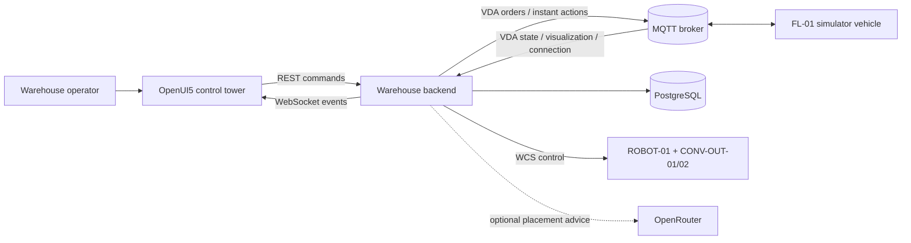
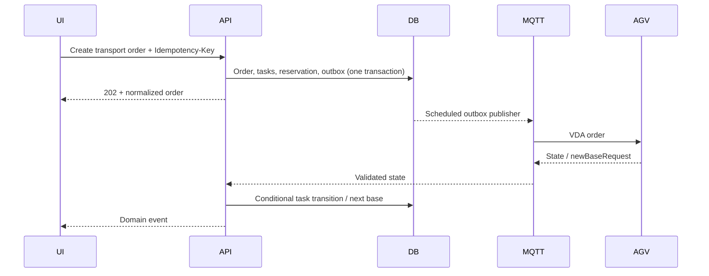

# Architecture

## System context

The backend is the transactional system of record. The simulator is deliberately isolated as an external device. MQTT is an integration boundary, not an internal method bus.

## Command and telemetry paths

Visualization follows a separate latest-value path: MQTT callbacks replace an in-memory pose, the backend emits lightweight pose events, and persistence samples at 2 Hz. Losing an intermediate pose is acceptable; losing a command is not.

Outbound adds a deterministic WCS cell after the AGV task: a pallet arrives at `OUT-STG-01`, carton rows become robot-pick jobs, `ROBOT-01` advances through `AT_HANDOFF → PICKING → PLACING`, and the WCS assigns each carton to the least-loaded `CONV-OUT-01` or `CONV-OUT-02` lane. Conveyor completion ships the carton and closes the business order.

## Ownership and consistency

Transport orders express operator intent; transport tasks are independently schedulable load movements; VDA orders are versioned device instructions. The dispatch audit links these layers without making the product API depend on VDA sequence mechanics. PostgreSQL transactions protect order/task/inventory changes. The outbox makes database commit and eventual MQTT publication observable; delivery is at-least-once, so stable order/update identities and conditional transitions provide idempotency.

## Code boundaries

The browser keeps REST commands and WebSocket event transport in separate services. Pure selectors and presentation builders derive operator-facing state; neither is authoritative for inventory or execution. Babylon material construction and telemetry interpolation are isolated from scene orchestration so pose and fork samples continue to share one delayed render clock.

Backend dispatch delegates vehicle selection to `fleet/VehicleAssignmentPolicy`, destination claims to `routing/ReservationService`, and business-task-to-VDA translation to `vda5050/VdaOrderFactory`. The public controller maps repository projections to explicit records under `api/dto`; JSON contracts remain unchanged. MQTT topic construction is transport-only, and pending delivery state is accessed through `persistence/outbox/OutboxRepository`. Business state, reservations, dispatch audit, and the outbox row are still committed in the original transaction before asynchronous publication.

The simulator remains an MQTT-only external vehicle. Its Paho session is isolated under `mqtt`, physical calculations under `vehicle`, and epoch/pause/time-scale behavior under `runtime`; none of these modules can access backend persistence.

## Invariants and failure behavior

- One active task per AGV, one active reservation per load, and one active destination-zone reservation per task.
- The fleet assignment chooses an idle, sufficiently charged vehicle; MQTT topics and VDA serial numbers remain vehicle-specific.
- Priority order is URGENT, HIGH, NORMAL, then creation/sequence order.
- An accepted VDA update never decreases `orderUpdateId`; stale epochs are ignored.
- Invalid VDA input becomes an observable rejection and cannot mutate domain state.
- Broker loss leaves commands pending; reconnect resumes outbox publication and synchronizes runtime state.
- AI advice is optional. Provider failure creates no tasks and changes no inventory.

## Code boundaries

The backend package structure follows the runtime boundaries above:

- `api` owns REST controllers, Problem Details, mapping, and public DTOs.
- `transport` orchestrates transport orders, tasks, dispatch, execution, and robotic-cell work.
- `fleet`, `routing`, and `inventory` own their respective policies and deterministic rules.
- `mqtt` owns broker transport; `vda5050` validates and interprets standard messages.
- `persistence.outbox` owns durable command publication.
- `events` publishes domain/application events to WebSocket clients.
- `scenario` owns demo presets and simulation controls.
- `observability` owns correlation context, client logs, and metrics.

The simulator mirrors an external vehicle. `vehicle` contains protocol-neutral physical state,
`execution` sequences orders/nodes/actions, `runtime` owns epoch-aware time and controls,
`mqtt` owns broker transport, and `vda5050` converts between logical state and validated wire
records. It has no backend database dependency.

## Capacity and trade-offs

The reference workload is one forklift AGV, carton-level outbound work, and 20 Hz visualization. A single PostgreSQL writer, destination-zone reservations, and a scheduled outbox are intentionally sufficient for this compact facility. Partitioned telemetry ingestion and horizontal command workers remain future scaling options rather than implicit assumptions.

The fleet is deliberately single-vehicle (`V20`). An earlier revision seeded `FL-02` and `FL-03` and made them claimable for transport tasks, but the parking and charging lifecycle stayed bound to `FL-01`, so the companions could never dock and therefore never recharge — the fleet decayed back to one vehicle as their batteries fell below the claim threshold. Adding a second vehicle is a coherent change, not a configuration flip: it requires threading `agvId` through `WarehouseStore.parkingTargets`, `WarehouseStore.enqueueParking`, and `DispatchService.parkIfIdle`, publishing to `Vda5050.topicPrefix(agvId)` instead of a literal topic, and giving each vehicle a reachable charging bay after reset.
